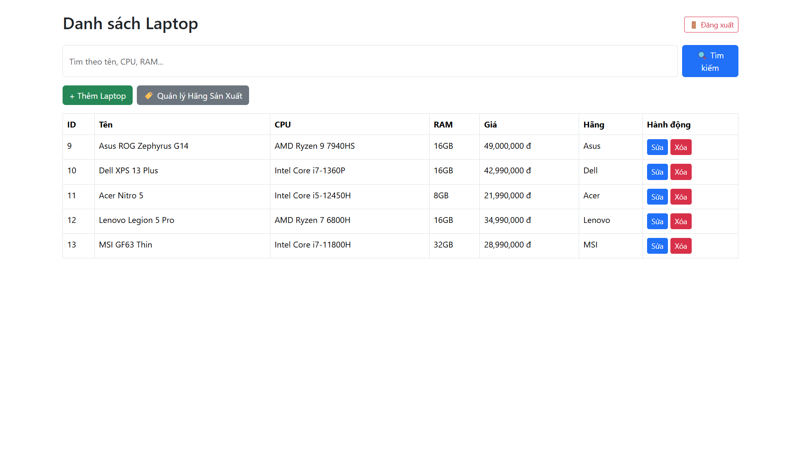
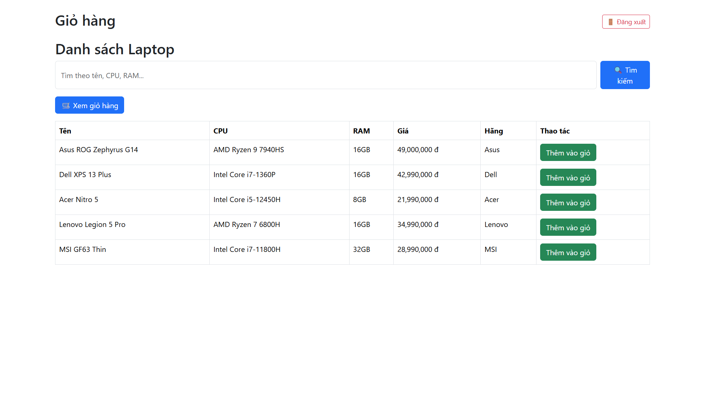

# 💻 Hệ Thống Quản Lý Cửa Hàng Laptop

> Ứng dụng web chuyên nghiệp giúp quản lý cửa hàng bán lẻ laptop, hỗ trợ phân quyền rõ ràng giữa **Quản trị viên** và **Khách hàng**, đảm bảo bảo mật, dễ mở rộng và thân thiện với người dùng.

---

## 🔑 Chức Năng Chính

### 👨‍💼 Quản trị viên
- 🔐 Đăng nhập / Đăng xuất an toàn  
- 🧾 Thêm, sửa, xóa, tìm kiếm sản phẩm laptop  
- 🏷️ Quản lý hãng sản xuất

### 🛒 Khách hàng
- 🧭 Duyệt sản phẩm theo hãng  
- 🔍 Tìm kiếm theo tên, CPU hoặc RAM  
- 📄 Xem chi tiết sản phẩm  
- 🛍️ Thêm / sửa / xóa sản phẩm trong giỏ hàng cá nhân  

---

## ⚙️ Công Nghệ Sử Dụng

| Thành phần    | Công nghệ                                      |
|---------------|------------------------------------------------|
| Backend       | Spring Boot, Spring Security                   |
| Frontend      | Thymeleaf, Bootstrap 5                         |
| Database      | MySQL 8.x                                      |
| Build Tool    | Maven 3.8+                                     |
| Java          | Java 17 trở lên                                |

---

## 📋 Môi Trường Cần Thiết

- Java 17 trở lên  
- Maven 3.8+  
- MySQL 8+  
- IDE khuyên dùng: IntelliJ IDEA / Eclipse / VS Code

---

## 🚀 Hướng Dẫn Cài Đặt

### 1️⃣ Tải mã nguồn

```bash
https://github.com/qthsodope/OOP_N03_Term3_2025_K17_Group5.git
cd OOP_N03_Term3_2025_K17_Group5
```

### 2️⃣ Tạo cơ sở dữ liệu MySQL

Mở terminal MySQL và chạy lần lượt 2 file sau trong `src/main/resources/database/`:

```sql
source src/main/resources/database/1-schema.sql;
source src/main/resources/database/2-data.sql;
```

> 💡 Bạn có thể dùng MySQL Workbench hoặc terminal đều được.

### 3️⃣ Cấu hình kết nối cơ sở dữ liệu

Mở 2 file sau và sửa lại tài khoản phù hợp với máy bạn:

#### `src/main/resources/application.properties`
```properties
spring.datasource.url=jdbc:mysql://localhost:3306/laptopdb
spring.datasource.username=root
spring.datasource.password=your_password
```

#### `src/main/java/com/laptopstore/util/JdbcUtil.java`
```java
private static final String URL = "jdbc:mysql://localhost:3306/laptopdb";
private static final String USER = "root";
private static final String PASSWORD = "your_password";
```

> 💡 Thay `your_password` bằng mật khẩu MySQL thực tế của bạn.

### 4️⃣ Chạy ứng dụng

- Mở bằng IntelliJ IDEA hoặc IDE tương thích  
- Chạy file `LaptopstoreApplication.java`  
- Truy cập: [http://localhost:8080](http://localhost:8080)

---

## 🖼️ Giao Diện Thực Tế

| Quản trị viên                             | Khách hàng                               |
|-------------------------------------------|-------------------------------------------|
|  |  |

---

## 👨‍💻 Thành Viên Nhóm

| Họ và tên             | Vai trò                                |
|------------------------|-----------------------------------------|
| **Nguyễn Quốc Thiên** | Viết DAO JDBC, bảo mật, kiến trúc backend |
| **Trần Đức Minh**     | Giao diện admin, controller, giỏ hàng     |
| **Nghiêm Xuân Khánh** | Tạo database, seed dữ liệu, hướng dẫn triển khai |

---

## 📌 Ghi Chú

- Đảm bảo MySQL đã được cài đặt và đang chạy trên máy bạn.  
- Nếu gặp lỗi, kiểm tra lại thông tin đăng nhập ở cả `JdbcUtil.java` và `application.properties`.

---

## 📬 Liên Hệ

- GitHub Issues: [Click here](https://github.com/qthsodope/OOP_N03_Term3_2025_K17_Group5/issues)  
- Email: [quocthien01082005@gmail.com](mailto:quocthien01082005@gmail.com)  
- LinkedIn: [Click here](https://www.linkedin.com/in/quoc-thien-nguyen)

---

🎉 *Cảm ơn bạn đã sử dụng hệ thống! Nếu thấy hữu ích, hãy cho chúng tôi một ⭐ trên GitHub!*
